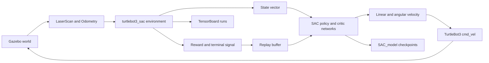

# TurtleBot3 SAC Navigation

Soft Actor-Critic (SAC) navigation for TurtleBot3 in a custom Gazebo environment.

This repository was extracted from a modified `ROBOTIS-GIT/turtlebot3_simulations` workspace and starts with a fresh Git history. It keeps only the custom SAC package and the minimal Gazebo assets needed for the custom environment.

## Results

Execution examples:


Training reward:


## Schematic



## Contents

- `turtlebot3_sac`: SAC agent, replay buffer, neural networks, ROS training nodes, validation nodes, and environment code.
- `turtlebot3_gazebo`: minimal custom Gazebo package containing the custom world, custom model, goal-box model, and launch file.
- `docs/assets`: README media files.
- `LICENSE.ROBOTIS`: upstream ROBOTIS license text kept for attribution and dependency clarity.

## Dependencies

This repository is not a standalone TurtleBot3 distribution. It expects a ROS Noetic catkin workspace with TurtleBot3 dependencies installed or cloned.

Required ROS packages include:

- `gazebo_ros`
- `xacro`
- `turtlebot3_description`
- `turtlebot3_msgs`
- `geometry_msgs`
- `sensor_msgs`
- `nav_msgs`
- `std_msgs`
- `std_srvs`
- `tf`
- `gazebo_msgs`

The Gazebo launch file spawns the robot through `turtlebot3_description`. If that package is missing, launch fails with:

```text
Resource not found: turtlebot3_description
```

Install the TurtleBot3 dependencies with apt:

```bash
sudo apt install ros-noetic-turtlebot3-description ros-noetic-turtlebot3-msgs
```

or clone the TurtleBot3 dependency repositories:

```bash
cd ~/catkin_ws/src
git clone https://github.com/ROBOTIS-GIT/turtlebot3.git
git clone https://github.com/ROBOTIS-GIT/turtlebot3_msgs.git
```

Do not clone the full upstream `ROBOTIS-GIT/turtlebot3_simulations` repository into the same catkin workspace as this repository. This repository already provides a minimal package named `turtlebot3_gazebo`, so a second package with the same name will cause package-resolution conflicts.

Python dependencies include:

- `numpy`
- `torch`
- `scipy`
- `matplotlib`
- `tensorboard` or `tensorboardX`, depending on the node used

## Build

Set the TurtleBot3 model:

```bash
export TURTLEBOT3_MODEL=burger
```

Build from the catkin workspace root:

```bash
cd ~/catkin_ws
catkin_make
source devel/setup.bash
```

If ROS Noetic accidentally uses a conda Python environment, build with the system Python:

```bash
PYTHONPATH=/opt/ros/noetic/lib/python3/dist-packages:/usr/lib/python3/dist-packages \
CMAKE_PREFIX_PATH=/opt/ros/noetic \
catkin_make -DPYTHON_EXECUTABLE=/usr/bin/python3
```

## Usage

Launch the custom Gazebo world:

```bash
roslaunch turtlebot3_gazebo basement3_world.launch
```

Launch SAC training:

```bash
roslaunch turtlebot3_sac turtlebot3_sac_stage_4.launch
```

Launch validation:

```bash
roslaunch turtlebot3_sac turtlebot3_sac_stage_1_validate.launch
```

## Configuration

Main training settings are in:

```text
turtlebot3_sac/node/default.py
```

Important fields:

- `gamma`, `tau`, `lr`, `alpha`: SAC optimization parameters.
- `batch_size`, `hidden_dim`, `replay_size`: training capacity and network size.
- `max_steps`, `max_episodes`: episode length and training duration.
- `state_dim`, `action_dim`: observation and action dimensions.
- `ACTION_V_MIN`, `ACTION_V_MAX`: linear velocity range.
- `ACTION_W_MIN`, `ACTION_W_MAX`: angular velocity range.
- `world`: checkpoint/log subdirectory name.
- `load_model`, `load_episode`: whether to resume from an existing checkpoint.

Training entrypoint:

```text
turtlebot3_sac/node/train_2.py
```

Model save/load logic:

```text
turtlebot3_sac/node/sac.py
```

Environment and reward logic:

```text
turtlebot3_sac/node/environment_stage_1.py
turtlebot3_sac/src/env/respawnGoal_3.py
```

## Generated Files

Running training or validation creates local experiment artifacts. These files are intentionally ignored by Git:

- `turtlebot3_sac/SAC_model/`: saved policy and critic checkpoints.
- `turtlebot3_sac/runs/`: TensorBoard event logs.
- `turtlebot3_sac/csv/`: validation CSV outputs.
- `*.pth`, `*.pt`: model weights.
- `events.out.tfevents*`: TensorBoard events.
- `*.ipynb`: local analysis notebooks.
- `__pycache__/`, `*.pyc`: Python cache files.

Use this to confirm ignored artifacts:

```bash
git status --ignored
```

## Validation Status

Checked during repository cleanup:

- Python syntax check passed for all `turtlebot3_sac` Python files.
- XML validation passed for package and launch files.
- `rospack find turtlebot3_sac` and `rospack find turtlebot3_gazebo` resolve to this repository.
- `roslaunch --files turtlebot3_sac turtlebot3_sac_stage_4.launch` resolves successfully.
- `catkin_make` passed in a clean temporary workspace containing only this repository and `/opt/ros/noetic`.
- `roslaunch --files turtlebot3_gazebo basement3_world.launch` requires `turtlebot3_description`; install or clone the dependency above before launching Gazebo.

## Notes

Some scripts are still experiment-specific variants. For a polished release, choose the official training and validation entrypoints and remove unused copies.
