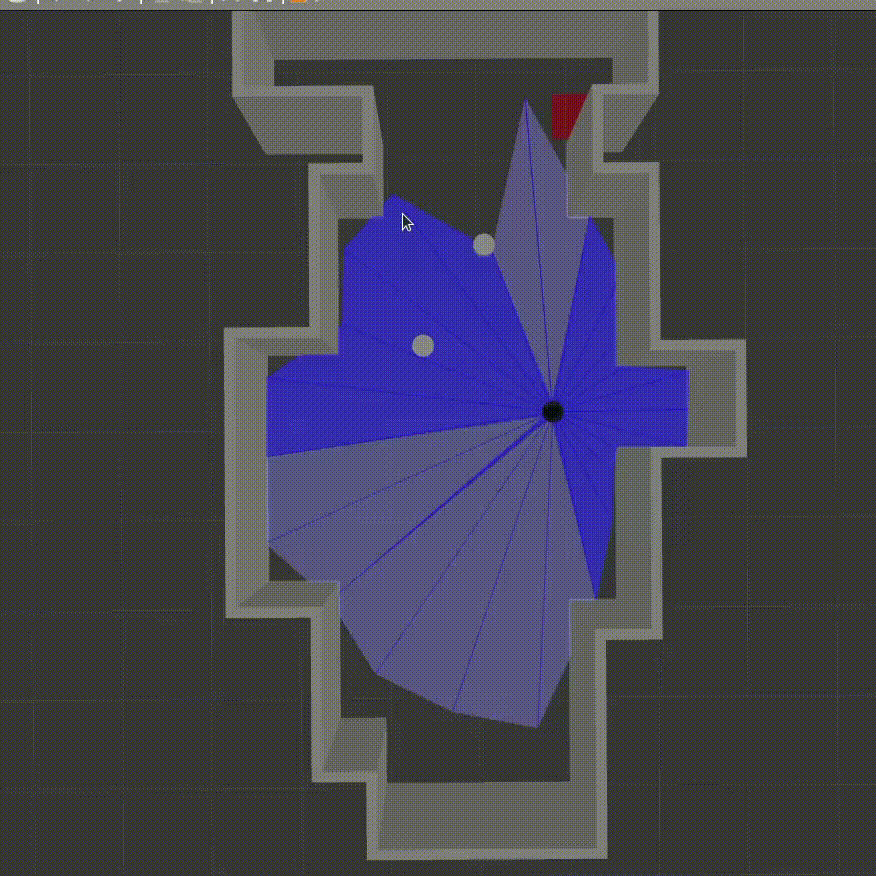
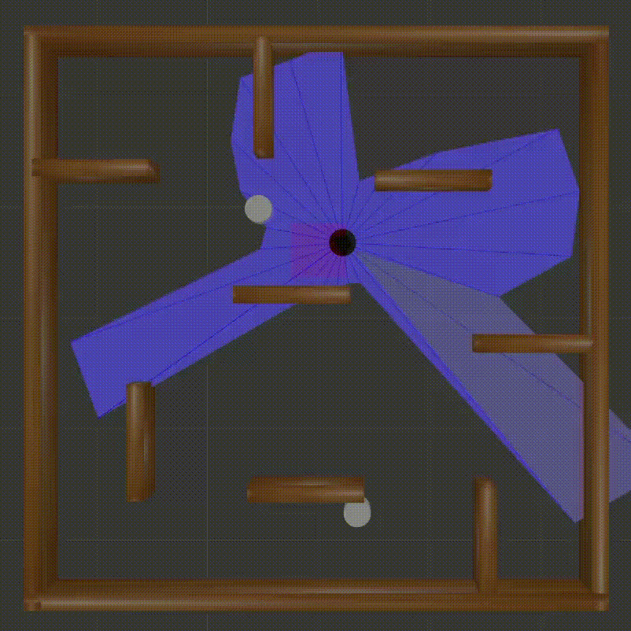
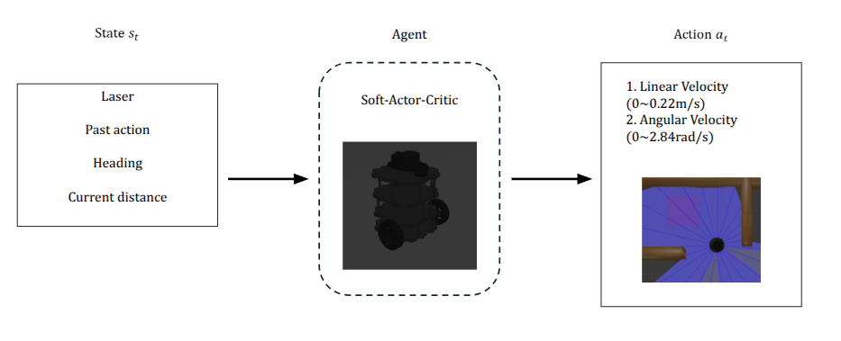

# TurtleBot3 SAC Navigation 한글 문서

TurtleBot3를 Gazebo 환경에서 Soft Actor-Critic(SAC)으로 학습시키는 ROS1 Noetic 프로젝트입니다.

이 프로젝트는 2024년 여름 성균관대학교 URP 프로젝트로 시작했고, 2024년 성균관대학교 기계공학부 학부학술제에서 수상했습니다.

핵심 아이디어는 간단한 맵에서 학습한 SAC 기반 TurtleBot3 navigation policy가 더 복잡한 형태의 맵에서도 장애물을 회피하며 이동할 수 있는지 확인하는 것입니다. README의 실행 결과 GIF는 복잡한 맵에서 학습된 모델이 목표 지점으로 이동하면서 회피 동작을 수행하는 모습을 보여줍니다.

## 폴더 구조

```text
docs/
gazebo/
sac/
```

- `docs`: README 이미지, GIF, 한글 문서 등 문서용 파일
- `gazebo`: ROS package `turtlebot3_gazebo`
- `sac`: ROS package `turtlebot3_sac`

폴더 이름은 보기 좋게 `gazebo`, `sac`로 정리했지만 ROS package 이름은 그대로 유지했습니다. 그래서 실행 명령은 `roslaunch turtlebot3_gazebo ...`, `roslaunch turtlebot3_sac ...` 형식입니다.

## 주요 파일 설명

### Gazebo 환경

| 파일 | 설명 |
| --- | --- |
| `gazebo/launch/basement3_world.launch` | Gazebo world를 열고 TurtleBot3 모델을 spawn하는 launch 파일 |
| `gazebo/worlds/basement3.world` | 복잡한 형태의 custom Gazebo map |
| `gazebo/models/basement3/` | `basement3.world`에서 사용하는 custom model |
| `gazebo/models/turtlebot3_square/goal_box/` | 목표 지점으로 spawn되는 goal box model |

### SAC 학습/검증

| 파일 | 설명 |
| --- | --- |
| `sac/launch/turtlebot3_sac_stage_4.launch` | SAC 학습 실행 launch 파일 |
| `sac/launch/turtlebot3_sac_stage_1_validate.launch` | 학습된 policy 검증 실행 launch 파일 |
| `sac/node/default.py` | 학습 설정값. episode 수, action range, model load 여부 등을 여기서 바꿈 |
| `sac/node/train_2.py` | 주 학습 entrypoint |
| `sac/node/sac.py` | SAC agent, model save/load, network update logic |
| `sac/node/network.py` | policy network와 Q network 정의 |
| `sac/node/buffer.py` | replay buffer |
| `sac/node/utils.py` | action scaling 등 helper 함수 |
| `sac/node/environment_stage_1.py` | ROS topic/service 기반 TurtleBot3 environment와 reward logic |
| `sac/src/env/respawnGoal_3.py` | goal position spawn logic |
| `sac/src/env/combination_obstacle_*.py` | 움직이는 장애물 제어 스크립트 |
| `sac/node/validate_3.py`, `sac/node/validate_4.py` | 학습된 policy 검증 및 CSV 결과 저장 |
| `sac/node/tensorboard_graph.py` | TensorBoard event에서 reward plot 생성 |

## 실행 결과

간단한 맵에서 학습한 모델을 기반으로 복잡한 맵에서도 회피 동작이 잘 나타났습니다.





학습 reward 결과는 다음과 같습니다.



## 설치와 빌드

ROS Noetic 환경을 기준으로 합니다.

```bash
sudo apt install ros-noetic-turtlebot3-description ros-noetic-turtlebot3-msgs
```

Python dependency:

```text
numpy
torch
scipy
matplotlib
tensorboard 또는 tensorboardX
rospkg
```

catkin workspace에서 빌드합니다.

```bash
cd ~/catkin_ws
catkin_make
source devel/setup.bash
```

conda Python 때문에 ROS Noetic 빌드가 꼬이면 system Python을 지정합니다.

```bash
PYTHONPATH=/opt/ros/noetic/lib/python3/dist-packages:/usr/lib/python3/dist-packages \
CMAKE_PREFIX_PATH=/opt/ros/noetic \
catkin_make -DPYTHON_EXECUTABLE=/usr/bin/python3
```

## 실행 방법

터미널 1:

```bash
export TURTLEBOT3_MODEL=burger
source ~/catkin_ws/devel/setup.bash
roslaunch turtlebot3_gazebo basement3_world.launch
```

터미널 2:

```bash
source ~/catkin_ws/devel/setup.bash
roslaunch turtlebot3_sac turtlebot3_sac_stage_4.launch
```

## Stage 차이

이 repository에서 `stage`는 Gazebo world 자체를 자동으로 바꾸는 이름이라기보다, SAC 실험 설정을 나누는 preset입니다. Gazebo world는 따로 `roslaunch turtlebot3_gazebo basement3_world.launch`로 실행하고, SAC launch 파일이 학습/검증 방식과 obstacle script를 선택합니다.

| Stage | launch 파일 | 용도 | 동작 |
| --- | --- | --- | --- |
| Stage 1 | `sac/launch/turtlebot3_sac_stage_1.launch` | 기본 SAC 학습 preset | `train_2.py`를 `/stage_number=1`로 실행합니다. 비교적 단순한 학습 설정입니다. |
| Stage 4 | `sac/launch/turtlebot3_sac_stage_4.launch` | 주 custom map 학습 preset | `train_2.py`를 `/stage_number=4`로 실행하고 `combination_obstacle_1.py`, `combination_obstacle_2.py`로 움직이는 장애물을 함께 실행합니다. |
| Stage 4 validation | `sac/launch/turtlebot3_sac_stage_1_validate.launch` | 복잡한 custom map 검증 | 파일명에는 stage 1이 들어가 있지만 실제 launch 내부에서는 `/stage_number=4`를 설정하고 `validate_3.py`를 실행합니다. |
| Stage 5 validation | `sac/launch/turtlebot3_sac_stage_5_validate.launch` | 추가 검증 preset | `validate_4.py`와 `combination_obstacle_3.py`, `combination_obstacle_4.py`를 실행합니다. |

정리하면, 간단한 navigation 환경에서 학습한 모델을 기반으로 더 복잡한 custom map에서도 obstacle avoidance가 잘 되는지 확인하는 흐름입니다. README의 GIF 결과는 복잡한 맵에서 회피가 잘 된 결과를 보여주는 것입니다.

## 설정 바꾸는 곳

대부분의 학습 설정은 여기서 바꿉니다.

```text
sac/node/default.py
```

주요 설정:

- `gamma`, `tau`, `lr`, `alpha`: SAC hyperparameter
- `batch_size`, `hidden_dim`, `replay_size`: 학습 batch, network 크기, replay buffer 크기
- `max_steps`, `max_episodes`: episode 길이와 전체 학습 episode 수
- `state_dim`, `action_dim`: state/action 차원
- `ACTION_V_MIN`, `ACTION_V_MAX`: 선속도 범위
- `ACTION_W_MIN`, `ACTION_W_MAX`: 각속도 범위
- `world`: model/log 저장 하위 폴더 이름
- `load_model`: 기존 checkpoint를 불러올지 여부
- `load_episode`: 불러올 episode 번호
- `/stage_number`: launch 파일에서 설정되는 ROS parameter. goal/validation logic이 stage별 동작을 구분할 때 사용합니다.

새로 학습할 때는 기본값처럼 `load_model = False`를 유지합니다. 기존 학습 모델로 이어서 돌릴 때는 `load_model = True`, `load_episode = 2500`처럼 바꾸면 됩니다.

## 실행하면 생기는 파일

학습이나 검증을 돌리면 아래 파일들이 생깁니다.

```text
sac/SAC_model/
sac/runs/
sac/csv/
```

- `sac/SAC_model/`: policy/value network checkpoint
- `sac/runs/`: TensorBoard event log
- `sac/csv/`: validation result CSV

이 파일들은 실험 산출물이기 때문에 Git에는 올리지 않도록 `.gitignore`에 넣어두었습니다. 로컬에는 남아 있고, GitHub에는 올라가지 않습니다.

## 학습된 모델 보관

대표 checkpoint는 `stage_4`의 2500 episode 모델입니다.

```text
sac/SAC_model/stage_4/2500_policy_net.pth
sac/SAC_model/stage_4/2500value_net.pth
```

이 두 파일은 로컬에서 아래 압축 파일로 묶어둘 수 있습니다.

```text
artifacts/stage4_episode2500_sac_checkpoint.tar.gz
```

현재 로컬 압축본 정보:

```text
size: 820K
sha256: f5993d4f7ce3378acf57584ffddb55ee31c1e2aad2ed4211ae54d67917f40b0e
```

`artifacts/`는 Git ignore 대상입니다. GitHub repository에 직접 넣기보다는 GitHub Releases, Google Drive, Hugging Face Hub 같은 별도 artifact 저장소에 올리는 방식을 권장합니다.

압축 모델을 받은 뒤 사용할 때는 다음 위치에 풀면 됩니다.

```text
sac/SAC_model/stage_4/
```

그 다음 `sac/node/default.py`에서:

```python
load_model = True
load_episode = 2500
world = 'stage_4'
```

로 설정하면 됩니다.

## 주의사항

이 repository는 `turtlebot3_gazebo`라는 최소 ROS package를 포함합니다. 같은 catkin workspace에 upstream `ROBOTIS-GIT/turtlebot3_simulations` 전체를 같이 clone하면 `turtlebot3_gazebo` package 이름이 충돌할 수 있습니다.

필요한 것은 `turtlebot3_description`, `turtlebot3_msgs` 같은 TurtleBot3 dependency이지, upstream simulation package 전체가 아닙니다.
